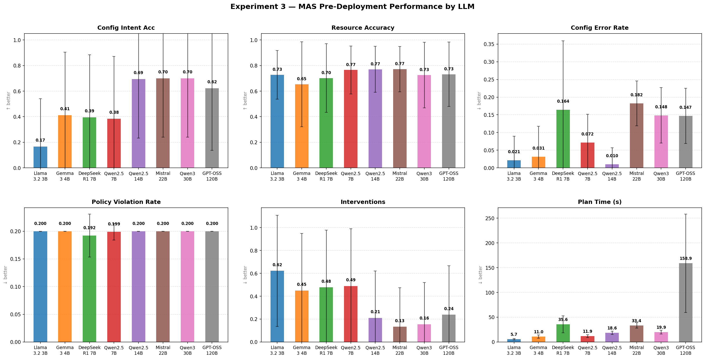
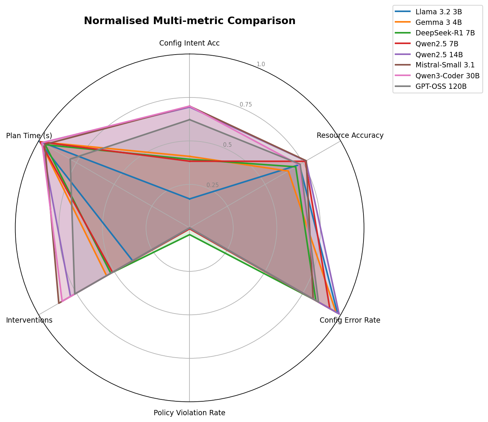
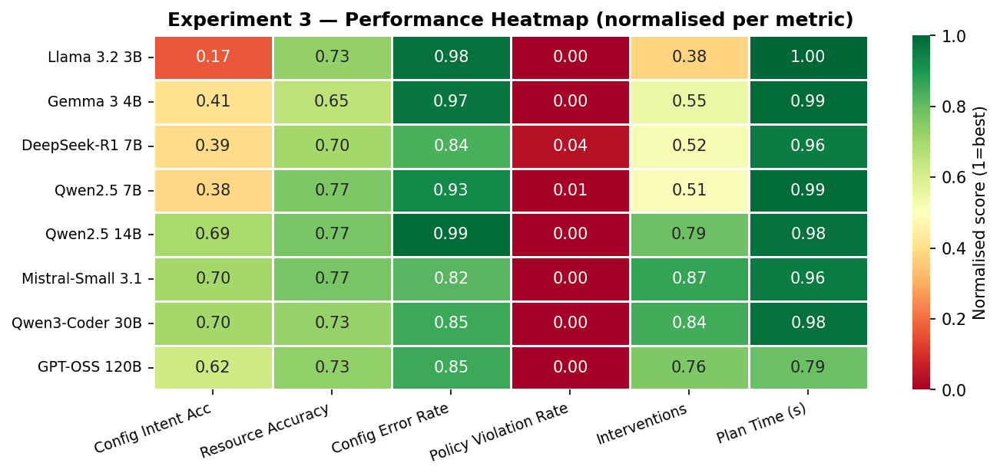
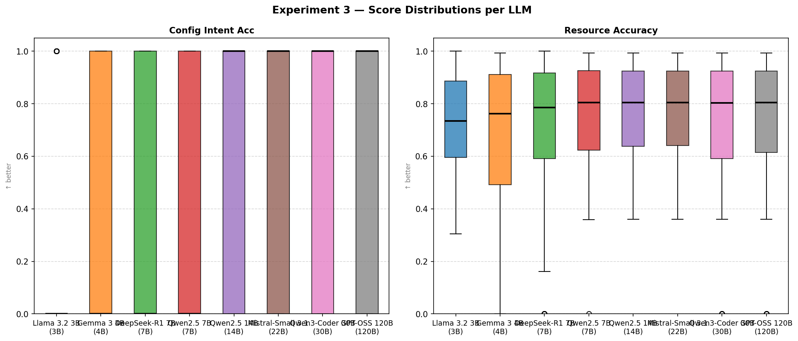
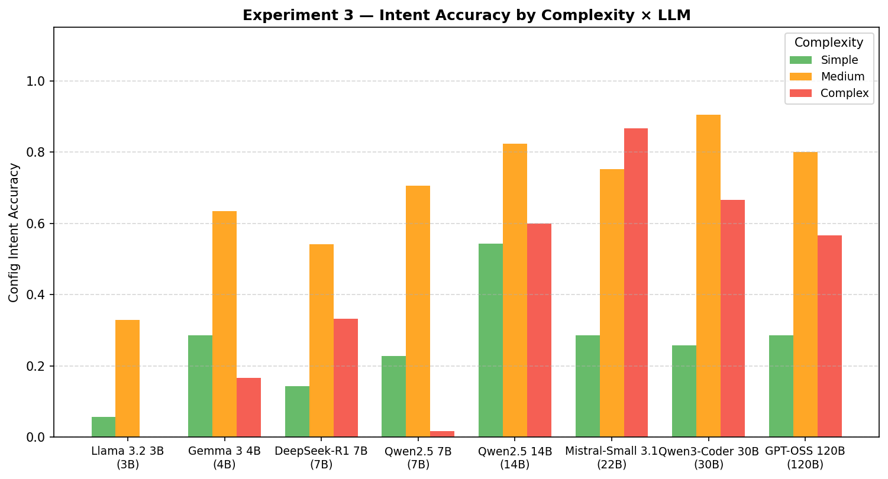

# Experiment 3 — LLM Comparison Report

Pre-deployment MAS pipeline evaluated with 5 different LLMs across 36 intents × 5 reps. No cluster deployment (config-only mode). Metrics are identical to Experiment 2.

## Summary Table

| LLM | Size (B) | N runs | Config Intent Acc | Resource Accuracy | Config Error Rate | Policy Violation Rate | Interventions | Plan Time (s) |
| --- | --- | --- | --- | --- | --- | --- | --- | --- |
| Llama 3.2 3B | 3 | 180 | 0.17 ± 0.37 | 0.73 ± 0.19 | 0.021 ± 0.068 | 0.200 ± 0.000 | 0.62 ± 0.49 | 5.7 ± 1.4 |
| Gemma 3 4B | 4 | 180 | 0.41 ± 0.49 | 0.65 ± 0.33 | 0.031 ± 0.086 | 0.200 ± 0.000 | 0.45 ± 0.50 | 11.0 ± 3.3 |
| DeepSeek-R1 7B | 7 | 180 | 0.39 ± 0.49 | 0.70 ± 0.27 | 0.164 ± 0.195 | 0.192 ± 0.039 | 0.48 ± 0.50 | 35.6 ± 17.1 |
| Qwen2.5 7B | 7 | 180 | 0.38 ± 0.49 | 0.77 ± 0.19 | 0.072 ± 0.080 | 0.199 ± 0.015 | 0.49 ± 0.50 | 11.9 ± 2.9 |
| Qwen2.5 14B | 14 | 180 | 0.69 ± 0.46 | 0.77 ± 0.18 | 0.010 ± 0.046 | 0.200 ± 0.000 | 0.21 ± 0.41 | 18.6 ± 3.4 |
| Mistral-Small 3.1 | 22 | 180 | 0.70 ± 0.46 | 0.77 ± 0.18 | 0.182 ± 0.064 | 0.200 ± 0.000 | 0.13 ± 0.34 | 33.4 ± 5.4 |
| Qwen3-Coder 30B | 30 | 180 | 0.70 ± 0.46 | 0.73 ± 0.26 | 0.148 ± 0.078 | 0.200 ± 0.000 | 0.16 ± 0.36 | 19.9 ± 3.9 |
| GPT-OSS 120B | 120 | 180 | 0.62 ± 0.49 | 0.73 ± 0.25 | 0.147 ± 0.078 | 0.200 ± 0.000 | 0.24 ± 0.43 | 158.9 ± 99.3 |

## Intent Accuracy by Complexity

| LLM | Complexity | N | Config Intent Accuracy |
| --- | --- | --- | --- |
| Llama 3.2 3B | Simple | 35 | 0.06 ± 0.24 |
| Llama 3.2 3B | Medium | 85 | 0.33 ± 0.47 |
| Llama 3.2 3B | Complex | 60 | 0.00 ± 0.00 |
| Gemma 3 4B | Simple | 35 | 0.29 ± 0.46 |
| Gemma 3 4B | Medium | 85 | 0.64 ± 0.48 |
| Gemma 3 4B | Complex | 60 | 0.17 ± 0.38 |
| DeepSeek-R1 7B | Simple | 35 | 0.14 ± 0.36 |
| DeepSeek-R1 7B | Medium | 85 | 0.54 ± 0.50 |
| DeepSeek-R1 7B | Complex | 60 | 0.33 ± 0.48 |
| Qwen2.5 7B | Simple | 35 | 0.23 ± 0.43 |
| Qwen2.5 7B | Medium | 85 | 0.71 ± 0.46 |
| Qwen2.5 7B | Complex | 60 | 0.02 ± 0.13 |
| Qwen2.5 14B | Simple | 35 | 0.54 ± 0.51 |
| Qwen2.5 14B | Medium | 85 | 0.82 ± 0.38 |
| Qwen2.5 14B | Complex | 60 | 0.60 ± 0.49 |
| Mistral-Small 3.1 | Simple | 35 | 0.29 ± 0.46 |
| Mistral-Small 3.1 | Medium | 85 | 0.75 ± 0.43 |
| Mistral-Small 3.1 | Complex | 60 | 0.87 ± 0.34 |
| Qwen3-Coder 30B | Simple | 35 | 0.26 ± 0.44 |
| Qwen3-Coder 30B | Medium | 85 | 0.91 ± 0.29 |
| Qwen3-Coder 30B | Complex | 60 | 0.67 ± 0.48 |
| GPT-OSS 120B | Simple | 35 | 0.29 ± 0.46 |
| GPT-OSS 120B | Medium | 85 | 0.80 ± 0.40 |
| GPT-OSS 120B | Complex | 60 | 0.57 ± 0.50 |

## Figures

### Figure 1 — Grouped bar chart (mean ± std per metric)

### Figure 2 — Radar chart (normalised multi-metric comparison)

### Figure 3 — Heatmap (normalised scores)

### Figure 4 — Box plots (score distributions)

### Figure 5 — Complexity breakdown

